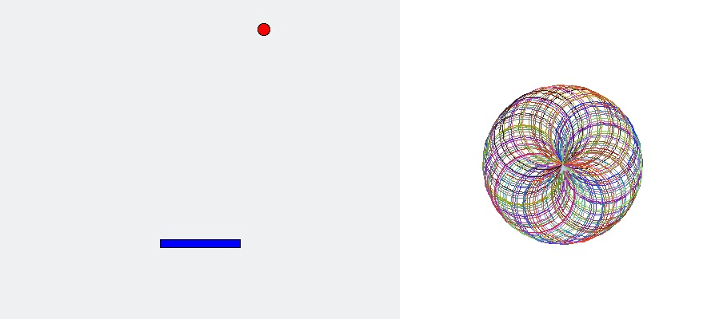

# Python Summer Camp Curriculum



A loose curriculum for a 30-hour Python summer camp for 5th to 8th graders

[Exercises](./exercises.md) | [Timeline](./timeline.md) | [Notes](./notes.md)

## Set up

Instructors should set up the computers for students prior to the camp. The following steps are for a Windows computer.

1.  Install [Visual Studio Code](https://code.visualstudio.com/)
2.  Search for and install the Code Runner extension *within* Visual Studio Code.

3.  Install [Python 3.x for Windows](https://www.python.org/downloads/)
4.  Go to the Settings within Visual Studio Code then replace the User Settings (it'll be the panel on the right) with the following:
```js
{
  "extensions.ignoreRecommendations": true,
  "code-runner.executorMap": {
    "python": "py"
  },
  "code-runner.runInTerminal": true
}
```
5.  You should now be able to run any Python program by opening the file in the editor window and clicking the grey play button in the top right hand corner


## Resources Used

- **Help Your Kids with Computer Coding** by Carol Vorderman, Claire Quigley, Craig Steele, Daniel McCafferty, Jon Woodcock, and Seán McManus
- **Python for Kids** by Jason R. Briggs
