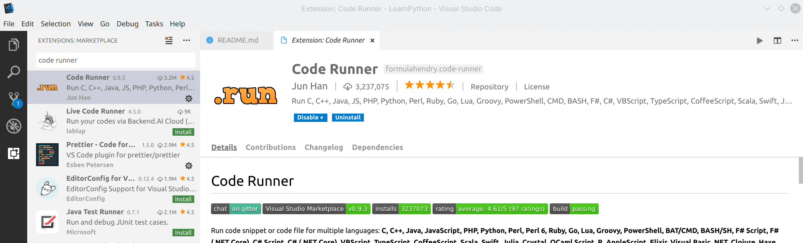

# Python Summer Camp Curriculum


A loose curriculum for a 30-hour Python summer camp for 5th to 8th graders

[Timeline](./timeline.md) | [Exercises](./exercises.md)

## How to use this

The [timeline](./timeline.md) serves as a guideline for the order of topics to cover. As you progress through the topics, provide [exercises](./exercises.md) to the students to reinforce the material learned.

The speed at which you can go through the material largely depends on the age group of the students, their typing speed, whether they have any prior experience with programming, and the length of the camp. Thus, add and remove items to and from the timeline and exercises as you see fit.

Usually you'll want students to end the camp with [pong](./camp_materials/pong/) since it incorporates most things they've learned in a usable and presentable package. Plus, the kids and parents love it.

## Setting up computers

Instructors should set up the computers for students prior to the camp. The following steps are for a Windows computer.

1.  Install [Visual Studio Code](https://code.visualstudio.com/) (not Visual Code! There's a difference!)
2.  Search for and install the Code Runner extension _within_ Visual Studio Code.
    
3.  Install [Python 3.x for Windows](https://www.python.org/downloads/)
4.  Go to the Settings within Visual Studio Code then replace the User Settings with the following:

```js
{
  "extensions.ignoreRecommendations": true,
  "code-runner.executorMap": {
    "python": "py"
  },
  "code-runner.runInTerminal": true
}
```

You may need to click the `{}` icon (top right hand corner in Settings) to copy and paste the above into the User Settings.

5.  You should now be able to run any Python program by opening the file in the editor window and clicking the grey play button in the top right hand corner
    

The steps to change the User Settings is subject to change since VSCode is periodically updated. If you need assistance, then please feel free to email me (Omkar).

For parents and kids who would like to set up their computers at home, see [for_parents.md](./for_parents.md).

## Resources Used

- _Help Your Kids with Computer Coding_ by Carol Vorderman, Claire Quigley, Craig Steele, Daniel McCafferty, Jon Woodcock, and Seán McManus
- _Python for Kids_ by Jason R. Briggs
