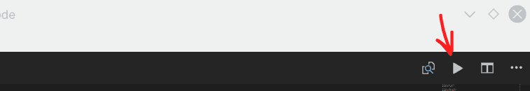

## Setting up your computer for Python

Expect to spend around 15-20 minutes.

1.  Install [Visual Studio Code](https://code.visualstudio.com/) (not Visual Code! There's a difference!). This where we write our code; it's similar to Notepad and is meant for writing and running code. Open Visual Studio Code for the next steps.
2.  To change the theme within Visual Studio Code, click on the gear icon in the bottom right hand corner then click on "Color Theme" and choose a theme.
3.  Search for and install the Code Runner extension _within_ Visual Studio Code.


The extensions icon is the square block on the black bar on the left edge of the screen (it's the only icon that's white on the black bar in the screenshot above). Search for "code runner", choose the first result, and click "Install".

4.  Install [Python 3.x for your computer](https://www.python.org/downloads/). This step is not related to Visual Studio Code but is necessary for running Python files.
5.  Go to the Settings within Visual Studio Code by clicking on the gear icon in the bottom left hand corner and choose "Settings":


The click on the {} icon in the top right hand corner:


then replace the User Settings with the following:

```js
{
  "extensions.ignoreRecommendations": true,
  "code-runner.executorMap": {
    "python": "py"
  },
  "code-runner.runInTerminal": true
}
```


And save your changes (CTRL + S).

5.  You should now be able to run any Python program by opening the file in the editor window (click "File" in the top, left hand corner then "Open File"/"Open Folder") and clicking the grey play button in the top right hand corner



When creating a new Python file, make sure it ends with the `.py` extension (e.g. `program.py`) because that's how the computer knows it's a Python file.

To test if everything works, create a new file ("File" > "New File"), type `print("Hello World!")`, save and name the file to `something.py` then click the grey Play button and your code should print "Hello World!" in the console.
